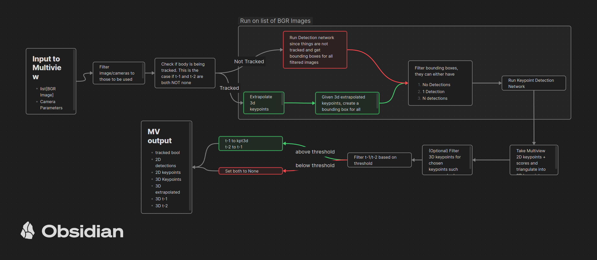

# Pi0 and Lerobot with Rerun
A repo to explore training robots with Pi0 and Lerobot and human pose motion retargeting

<p align="center">
  <a title="Website" href="https://rerun.io/" target="_blank" rel="noopener noreferrer" style="display: inline-block;">
          
      </a>
    <a title="Website" href="https://www.physicalintelligence.company/blog/openpi" target="_blank" rel="noopener noreferrer" style="display: inline-block;">
        
    <a title="arXiv" href="https://arxiv.org/html/2410.24164v1" target="_blank" rel="noopener noreferrer" style="display: inline-block;">
        
    </a>
    <a title="Github" href="https://github.com/pablovela5620/pi0-lerobot" target="_blank" rel="noopener noreferrer" style="display: inline-block;">
        
    </a>
    <a title="Social" href="https://x.com/pablovelagomez1" target="_blank" rel="noopener noreferrer" style="display: inline-block;">
        
    </a>
  </p>

<p align="center">
  
</p>

## Installation
Currently only linux is supported
### Using Pixi
Make sure you have the [Pixi](https://pixi.sh/latest/#installation) package manager installed
```bash
git clone https://github.com/rerun-io/pi0-lerobot.git
cd pi0-lerobot
```

## Usage
### Human Pose and Kinematics

<p align="center">
  
</p>

For HOCap dataset, sample is automatically downloaded from dataset on command run. Checkout example rrd file [here](https://app.rerun.io/version/0.22.1/index.html?url=https://huggingface.co/datasets/pablovela5620/rrd-examples/resolve/main/hocap-example.rrd)

For the full assembly101 dataset go to this [link](https://github.com/assembly-101/assembly101-download-scripts) to get/download dataset

To run dataset visualization
```bash
pixi run visualize-hocap-dataset # recommended
pixi run visualize-assembly101-dataset
```

Current Pipeline
<p align="center">
  
</p>


To run 2D pose estimation, tracking, and triangulation
```bash
pixi run pose-estimation-assembly101
```
### Jupyter Notebook Tutorials
```bash
pixi run notebook_tutorial
```

## TODO
### Part 1. Human Pose and Kinematics
- [x] Basic Triangulation from 2D Detection (body pose)
- [x] Basic Triangulation from 2D detection (hand pose)
- [x] Detection by Tracking (extrapolate 3d views-> Generate bounding box based on extrapolated -> check based on kpts confidence)
- [ ] Mano + SMPL fitting for skeleton kinematics
- [ ] Add EgoCentric (first person) headset views and poses

### Part 2. Body and Hand Pose Retargeting
- [ ] Implement pose retargeting to isaac sim

### Part 3. Immitation Learning and Teleoperation
- [x] Notebook Tutorials
- [ ] Finetune and evaluation on Aloha simulator with Pi0
- [ ] Finetune base Pi0 on [SO-ARM100](https://github.com/TheRobotStudio/SO-ARM100) from lerobot
